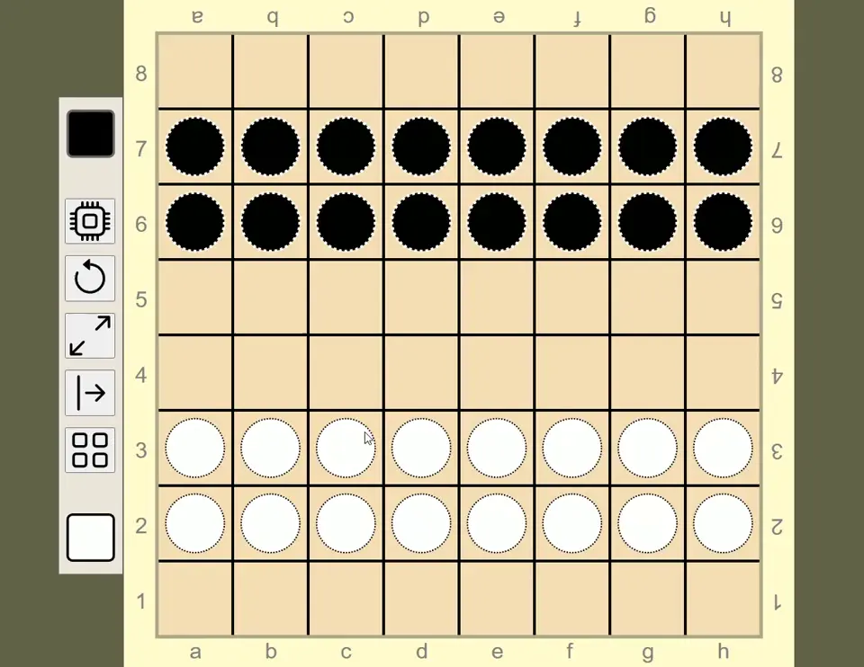

# Dama
Türk dama oyunudur.

## [>> Demo için tıklayın](https://alperali.github.io/dama/)
> Demo için güncel bir Firefox, Chrome, Edge vs sürümü kullanın.

- Gerçek kişi veya bilgisayara karşı oynayabilirsiniz (çevrim içi eşleşme henüz yoktur, tablet/surface üzerinde karşılıklı iki kişi oynayabilir).
  Oyun sırasında gerçek kişi - makina arası geçiş yapılabilir, oyun kaldığı yerden devam eder.

- *Denetim işlevleri:* Tahta çevirme, büyültme/küçültme, sıfırlama(yeni oyun), oyuncu seçimi, çubuk taşıma.

- *Görsel işlevler:* Sayaçlar, alım kılavuzları (zorunlu taş alımında yanlış kareye tıklanırsa kılavuzlar belirir), sıra göstergesi (yatay yeşil çubuk).

- Oyundan çıkıp sonra geri döndüğünüzde oyun kaldığı yerden devam eder (`localStorage`da tahtanın son hali kayıt edilmektedir).

**Bulduğunuz hataları alper.goplay@gmail.com adresine bildirin, veya Issues altında bir kayıt açın.**

## Özellikleri
- **PWA (_Progessive Web App_) :**  
  Hem çevrimiçi hem de çevrimdışı çalışabilir.
  Chrome, Edge, Safari, PWA destekli tarayıcı kullanan her platformda çalışır, kurulabilir.
  PWABuilder, Bubblewrap gibi araçlar ile mobil marketlere uygun paketlenip yüklenebilir
  (_Trusted Web Activity(TWA)_ bazlı örnek bir APK _Releases_ altına eklenmiştir).
- **_Responsive_ tasarım:**  
  Telefon, tablet, dizüstü, masaüstü, smartTV, vb her ekran boyutuna uygundur.
- **Temel dama kurallarını uygular:**  
  Taş almak zorunludur. Birden fazla taş alma yolu varsa en fazla taş alınan yolu seçmek zorunludur,
  eşit sayıda taş alma durumunda seçim oyuncuya bırakılır.
  Dama, son taş aldığı yönün tam tersi yönde taş almaya devam edemez. Yapılan hamle geri alınmaz.
- **Temel web teknolojilerine dayanır:**  
  Html, CSS, Javascript, SVG kullanılarak geliştirilmiştir.
  Herhangi bir oyun motoru veya _framework_ kullanmaz, %100 yerlidir.
